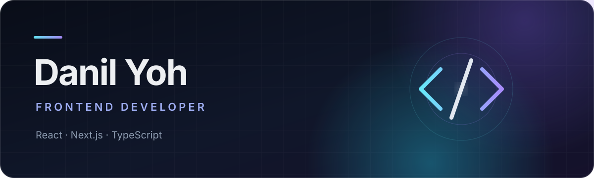

  

  I build thoughtful web products with clear interfaces, reliable data flows, 
  and the engineering discipline to ship with confidence.

  
  

## Selected work

### [Startup Zone](https://github.com/DanilYoh/startup-zone)

A production-minded marketplace foundation with a secure data model, authorization, tested user flows, and CI.

`Next.js` · `TypeScript` · `Supabase` · `Playwright` 
[Live demo](https://startup-zone-danilyoh.vercel.app) · [Source code](https://github.com/DanilYoh/startup-zone)

### [AgentGate](https://github.com/DanilYoh/AgentGate)

A local pre-commit firewall for reviewing AI-generated changes before they enter a repository.

`TypeScript` · `Node.js` · `Git` · `SARIF` 
[Source code](https://github.com/DanilYoh/AgentGate)

### [Airline booking platform](https://github.com/DanilYoh/airline-booking-frontend)

A large customer and admin application covering flight search, booking, payments, and account management.

`React` · `TypeScript` · `Redux Toolkit` · `Chakra UI` 
[Product tour](https://github.com/DanilYoh/airline-booking-frontend#product-tour) · [Source code](https://github.com/DanilYoh/airline-booking-frontend)

### [Pizza storefront](https://github.com/DanilYoh/pizza-storefront)

A responsive storefront with catalog filters, search, pagination, routing, lazy loading, and a persistent cart.

`React` · `TypeScript` · `Redux Toolkit` · `Vitest` 
[Live demo](https://pizza-storefront-danilyoh.vercel.app) · [Source code](https://github.com/DanilYoh/pizza-storefront)

## Toolkit

  
  
  
  
  
  
  
  

